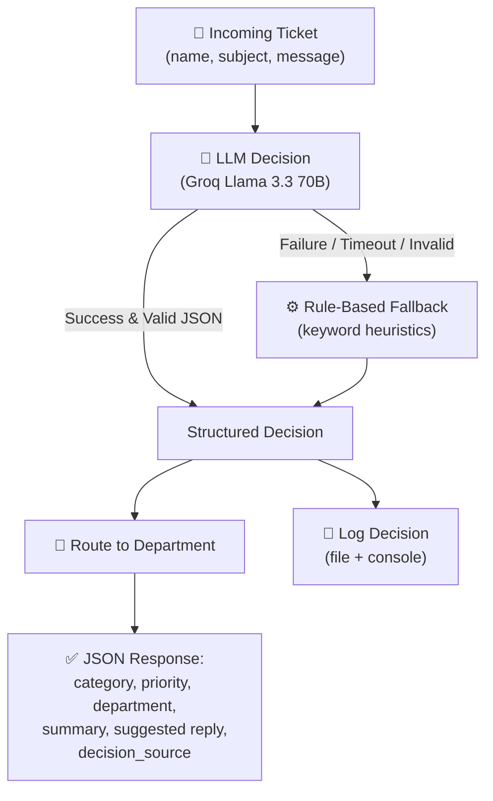

<div align="center">

# ⚙️ AI Workflow Automation System

### End-to-end customer support ticket triage and routing — LLM-powered decisions with a bulletproof rule-based fallback and a custom ops dashboard.


[Overview](#-overview) • [Features](#-features) • [How It Works](#-how-it-works) • [Getting Started](#-getting-started) • [API Reference](#-api-reference)

</div>

---

## 📌 Overview

A production-shaped automation workflow that takes a raw customer support
ticket and, with zero human intervention, classifies it, prioritizes it,
routes it to the right department, and drafts a reply — using an LLM
(**Groq / Llama 3.3 70B**) for the decision-making step, with a fully
independent rule-based fallback so the workflow **never goes down**, even if
the LLM API is unavailable.

Built as part of the **Calder AI/ML Internship** project assignment.

## ✨ Features

- 🧠 **LLM-based decision making** — category, priority, summary, and a drafted reply, all from one call
- ⚙️ **Rule-based fallback** — guarantees uptime even without API access
- ✅ **Output validation** — invalid/malformed LLM responses are caught and rerouted to the fallback automatically
- 📨 **Automatic department routing** based on ticket category
- 🚨 **Human-review flagging** for legal, security, or critical issues
- 📝 **Full audit logging** — every decision is logged to file and console
- 🌐 **Custom dashboard UI** at `/` with live status, quick examples, and structured ticket results
- 🔄 **Decision source tracking** so responses show whether the LLM or fallback rules handled the ticket
- 🌐 **Clean FastAPI architecture** with Pydantic-validated schemas

## 🧠 How It Works



## 🛠️ Tech Stack

| Component       | Technology                                     |
| --------------- | ---------------------------------------------- |
| API Framework   | FastAPI + Uvicorn                              |
| Decision Engine | Groq API (Llama 3.3 70B) + rule-based fallback |
| Frontend        | HTML, CSS, and vanilla JavaScript              |
| Validation      | Pydantic                                       |
| Logging         | Python `logging` (file + console handlers)     |

## 📁 Project Structure

```
ai-workflow-automation/
├── models.py            # Pydantic request/response schemas
├── workflow.py          # LLM decision logic + rule-based fallback
├── logger_config.py     # structured logging setup
├── app.py               # FastAPI application
├── templates/           # dashboard HTML
├── static/              # dashboard CSS/JS
├── logs/                # workflow.log generated at runtime
├── .env.example
├── requirements.txt
└── README.md
```

## 🚀 Getting Started

### Prerequisites

- Python 3.10+
- A free [Groq API key](https://console.groq.com) (optional — see note below)

### Installation

```bash
git clone https://github.com/<your-username>/ai-workflow-automation.git
cd ai-workflow-automation

python -m venv venv
source venv/bin/activate        # Windows: venv\Scripts\activate

pip install -r requirements.txt
cp .env.example .env
```

Add your free Groq key to `.env`:

```
GROQ_API_KEY=your_key_here
```

> 💡 No key? No problem — the workflow automatically uses its rule-based fallback, so the project is fully demoable with zero setup cost.

### Run the API

```bash
uvicorn app:app --reload
```

Open **http://127.0.0.1:8000/** for the custom ops dashboard.

Open **http://127.0.0.1:8000/docs** for interactive Swagger documentation.

## 📡 API Reference

| Method   | Endpoint           | Description                                  |
| -------- | ------------------ | -------------------------------------------- |
| `GET`    | `/`                | Dashboard UI                                 |
| `GET`    | `/status`          | System status and LLM availability           |
| `POST`   | `/submit-ticket`   | Submit a ticket for automated triage         |

### Example Request

```bash
curl -X POST http://127.0.0.1:8000/submit-ticket \
  -H "Content-Type: application/json" \
  -d '{
    "customer_name": "Ali Raza",
    "subject": "Refund not received",
    "message": "I was charged twice for my subscription and need a refund immediately."
  }'
```

### Example Response

```json
{
  "ticket_id": "af1798c9",
  "category": "Billing",
  "priority": "Medium",
  "department": "Billing Department",
  "summary": "Customer was double-charged and is requesting a refund.",
  "suggested_reply": "Thanks for flagging this, Ali — I'm sorry for the inconvenience...",
  "requires_human_review": false,
  "decision_source": "llm"
}
```

### Sample Log Output

```
2026-06-20 16:26:09 | INFO    | Ticket af1798c9 received from Ali Raza: 'Refund not received'
2026-06-20 16:26:09 | INFO    | Ticket af1798c9 routed to Billing Department | priority=Medium | source=llm | human_review=False
```

## 🧩 Design Notes

| Decision                | Why                                                                       |
| ----------------------- | ------------------------------------------------------------------------- |
| Hybrid LLM + rule-based | LLM handles nuance; rules guarantee the workflow never goes down          |
| Output validation       | Category/priority are checked against an allowed set before being trusted |
| Decision source flag    | The response shows whether routing came from the LLM or fallback rules    |
| Full logging            | Every stage is auditable — receipt, decision source, routing, failures    |

## 🖥️ Dashboard Flow

The custom root page is designed as an operations console instead of a plain API landing page:

1. The sidebar shows current system status and a quick LLM availability indicator.
2. Example tickets let you populate the form with one click.
3. The main workspace sends the ticket to `POST /submit-ticket`.
4. The response is rendered as a structured decision card, including `decision_source`.
5. If the LLM fails or is unavailable, the backend falls back to the keyword-based rules and still returns a routed decision.

This input → LLM-decision → fallback → structured-output → logging pattern
can be repointed at other workflows (invoice processing, lead qualification,
content moderation) by swapping out the prompt and category set in
`workflow.py`.

## 📄 License

This project is licensed under the MIT License — see the [LICENSE](LICENSE) file for details.

---

<div align="center">

**Built by [Your Name]** · [GitHub](https://github.com/<your-username>) · [LinkedIn](https://linkedin.com/in/<your-profile>)

</div>
